В начале работы нам нужно разобраться с уже готовым докер образом для сервера.
Наш выбор пал на довольно простой nginx.
1. [Готовый докер](#Part-1.)
2. [Операции с контейнером](#Part-2.)
3. [Мини веб-сервер](#Part-3.)

## Part-1.
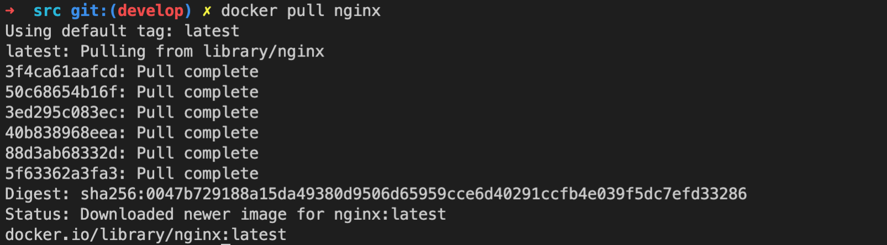
Берем из официального репозитория docker, образ nginx. 

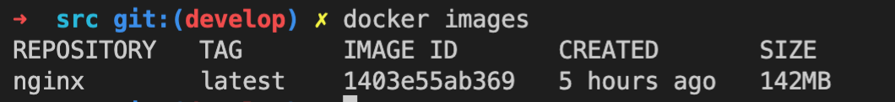
Проверяем наличие докер образа через docker images

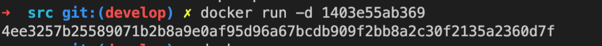 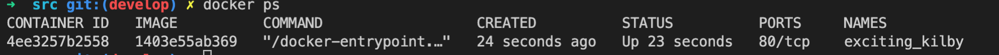
Запускаем образ и следом проверям, какие образы у нас заупщены.
*-d - ключ, обозначающий запуск контейнера в режиме службы.

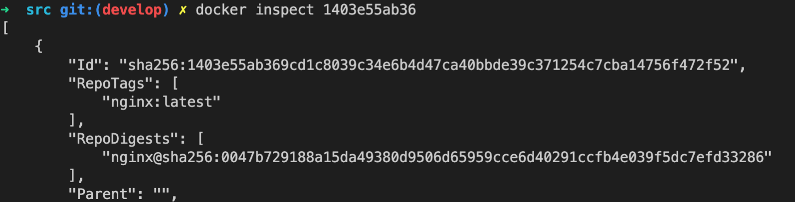
Смотрим информацию о контейнере, выходит список, расшифруем некоторые элементы

-размер контейнера "Size": 141812353
-список замапленных портов "ExposedPorts": "80/tcp"
-ip контейнера  "IPAddress": "172.17.0.2"

Далее мы отсанавливаем образ, проверяем что нет активных сесий в докере.

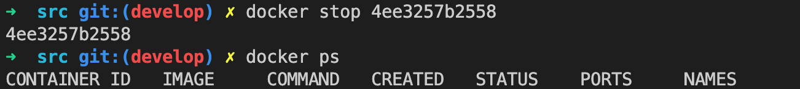

И следом, снова запускаем докер с замапленными портами 80 и 443
:docker container run -p 80:80 -p 443:443 -d nginx
первый аргумент это локальный порт, второй это порт который мы хотим замапить в докер контрейне

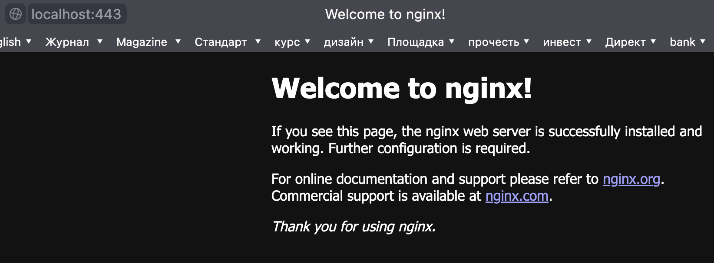
Пороверям что обращаясь к порту 443 мы выходим на страницу nginx

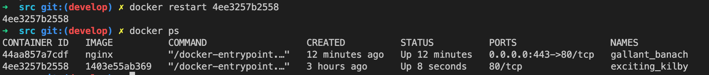
Перезапускаем докер, и видим что у нас на данный момент активны два образа.

## Part-2.
Докер образ и контейнер готовы. Теперь можно покопаться в конфигурации nginx и отобразить статус страницы.

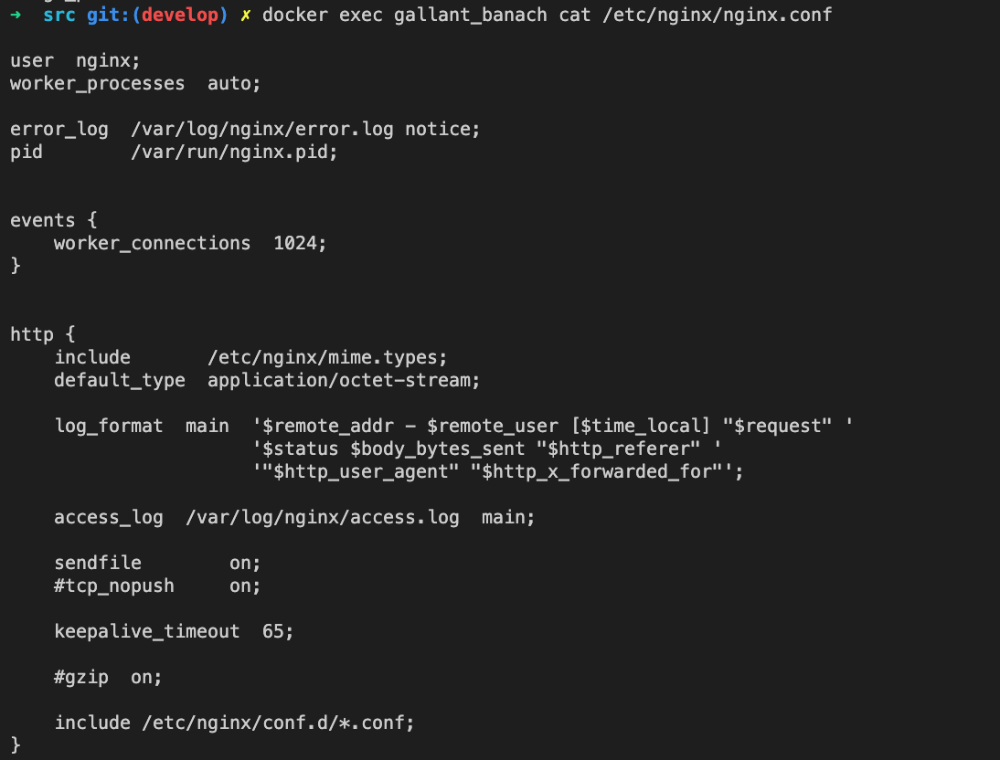
Прочитать конфигурационный файл nginx.conf внутри докер контейнера через команду exec.
###### Полезная инфа: http://nginx.org/ru/docs/beginners_guide.html

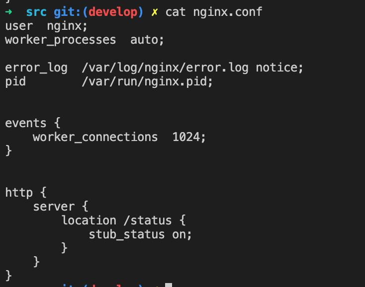
Создать на локальной машине файл nginx.conf

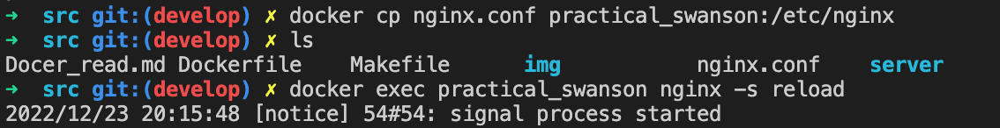
Скопировать созданный файл nginx.conf внутрь докер образа через команду docker cp.
Перезапустить nginx внутри докер образа через команду docker exec name_container nginx -s reload 
Открываем браузер http://localhost/status
и получаем инормацию
>Active connections: 2 
>server accepts handled requests
>13 13 21 
>Reading: 0 Writing: 1 Waiting: 1

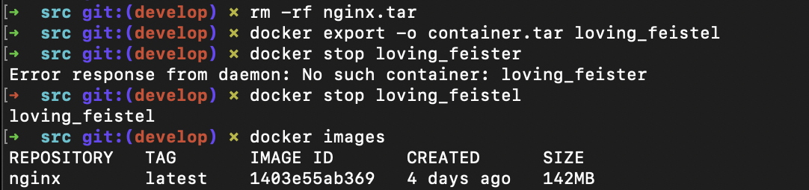
Экспортировать контейнер в файл container.tar через команду export, останавливаем его и следом принудительно удалим (docker rmi -f images), но остались сохраненые контейнеры

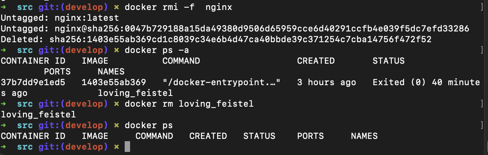
иправляем это.....Ох блин, я оплашал, мне для чего нужно веруть мой image, благо мы отавили архив который имортируем обратно, c помощью команды  "docker import container.tar name_image".

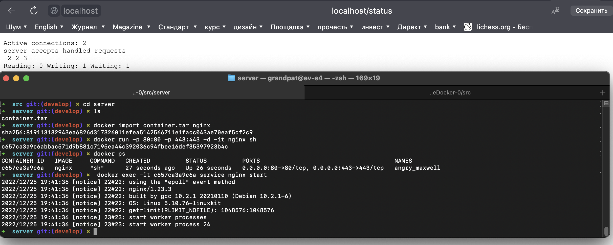
После приведенных команд, востанавливаем наш image, через команду import, запускаем nginx командой docker exec -it image_id service nginx start.

###### Полезная инфа: https://www.youtube.com/watch?v=oUzHjXdq7gk

## Part-3.
Написать мини сервер на C и FastCgi, который будет возвращать простейшую страничку

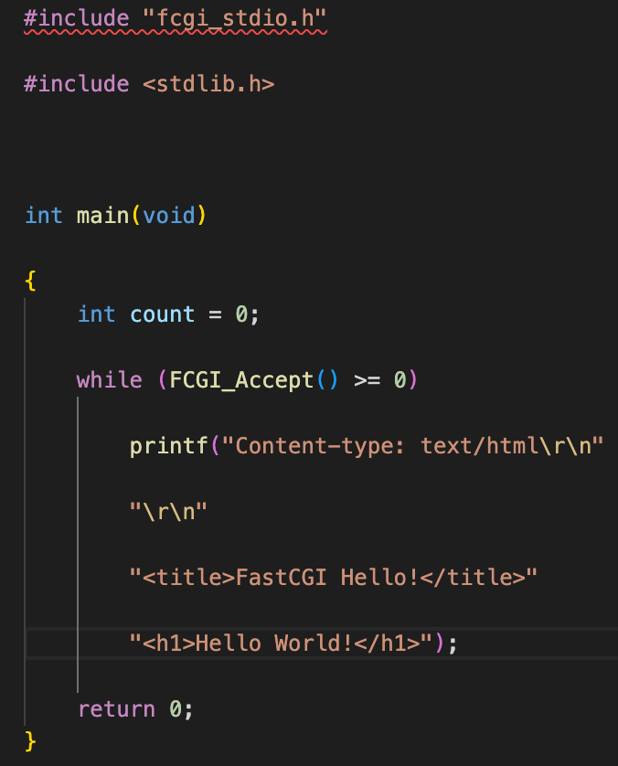
Окозалось не так много писать, но почемуто тяжело было найти информацию.
* запускаем контейнер за портами docker run -р 81:81 -d nginx
* копируем послностью паку с кодом docker cp server name_container:/
* заходим в контейнер, docker exec -it name bash
* устанавливаем все необходимое: apt install gcc, libfcgi-dev, spawn-fcgi.
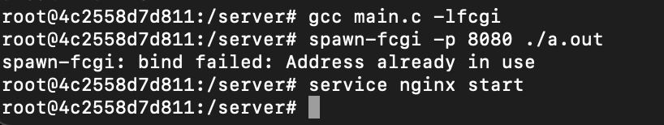
* так же изменяем последнии строчки файла конфигруции

>    server {
>        listen       80 default_server;
>        server_name localhost; 
>        location / { 
>            fastcgi_pass 127.0.0.1:8080;
>            include fastcgi_params; 
>        }
>    }

Перезапускаем (docker exec name nginx -s reload) и проверяем 

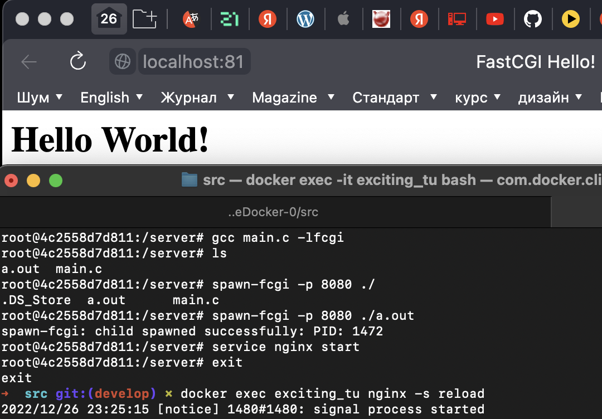
###### Полезна ссылка: https://www.youtube.com/watch?v=WBzCg-mywWQ https://itnan.ru/post.php?c=1&p=645925

## Part-4.
* Создаем Dokerfile

* Собираем Dockerfile командой docker build -t grandpat:latest .
* Запускаем контейнер командой docker run --rm  -p 80:81 -d --name server grandpat
* Или скриптом sh build.sh
###### Если по каким то причинам страничка не выходит, заходим в докер и запускаем скопированный скрипт:
* docker exec -it server bash
* попадая в оболочку контейнера sh run.sh
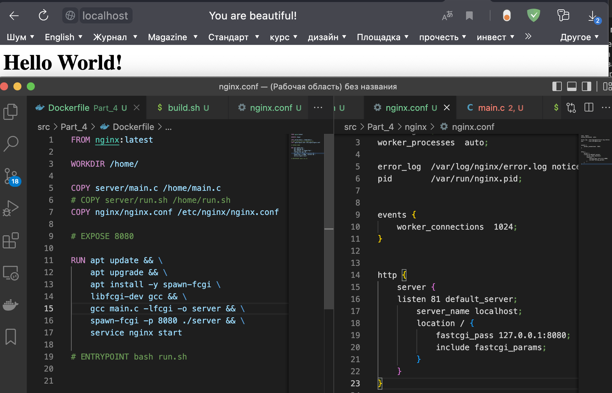

###### Полезна ссылка: https://vladilen.notion.site/Docker-2021-a72201ec8573461c8a2e62e2fcf33aa3  https://www.youtube.com/watch?v=ZB8JBWriDVo

## Part-5.
* Устанавливаем brew install dockle 
* Выполянем команду dockle -ak NGINX_GPGKEY grandpat:latest

## Part-6.
* Прописываем docker-compose.yaml файл
* Выполняем команду docker-compose build
* docker-compose up
###### Полезна ссылка: https://habr.com/ru/company/ruvds/blog/450312/